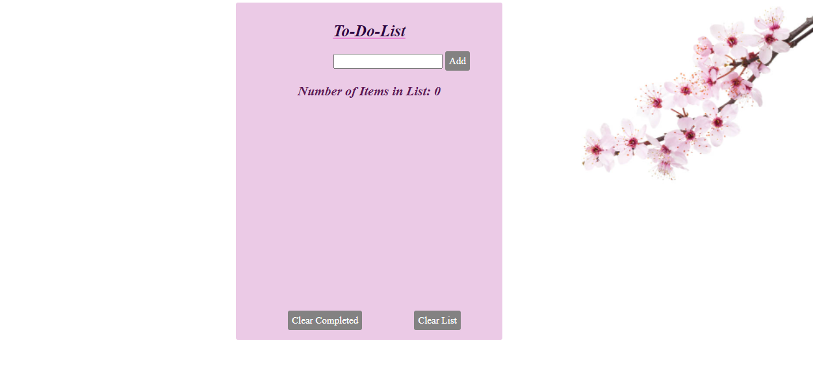

# 🎰 Week05 Bootcamp2019 Project: Slot Machine

### Goal: Build a Simple Slot Machine

Build a simple slot machine with minimum 5 items per reel and 3 reels - user should be able to bet min or max and have their total update]

###  My Slot Machine Project
This project highlights my use of HTML, CSS and javaScript; an eye catching, functional program enabling users to have a real casino night feel.Users are able bets against the house in hopes to leave with more money than they began with.
**Link to project: https://ddslotmachine.netlify.app/** 

## How It's Made:

**Tech used:** HTML, CSS, JavaScript

I utilized my skills in javaScript, HTML and CSS to create functions, event listeners, conditions and more: the utilization of these allowed me to make a user interactive slot machine game. the use of" if" conditions were heavily used to print and run code as the user either loses or wins money. I the 3 slot assigned a variable to obtain the Math.randomnumer so the game would generate the 3 slots seen above.

## Lessons Learned:
I learned to make global and local variables to use in functions further down in my code. I also learned to change a string value to be that of an integer and back to a string. 
